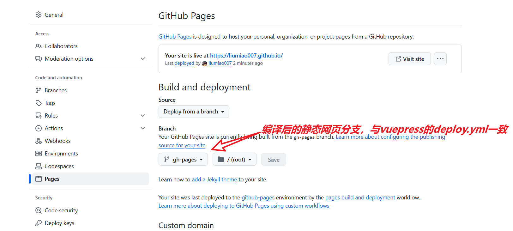

## 创建仓库

用户名.github.io

## token创建

settings 

进入 左侧最下面  deploy 

选择权限 点击生成

## 填写token

在仓库的配置中的Secrets and variables 中填上刚才的token

修改deploy-docs.yml

steps下面添加

```
        env:
          # @see https://docs.github.com/cn/actions/reference/authentication-in-a-workflow#about-the-github_token-secret
          GITHUB_TOKEN: ${{ secrets.GITHUB_TOKEN }}
```

## 部署分支确认

默认是press 是发布到gh_pages

```
        with:
          # 部署到 gh-pages 分支
          target_branch: gh-pages
          # 部署目录为 VuePress 的默认输出目录
          build_dir: docs/.vuepress/dist
```



## 域名确认

默认仓库 用户名.github.io

还可以创建 一个新仓库 设置为githubpages

区别在于要修改deploy-docs.yml

则将 `base` 设置为 `"/<REPO>/"`

```
export default defineUserConfig({
  base: '/'   // 默认是 /   指定仓库换成 /<REPO>/
  lang: 'en-US',

```


github 部署配置示例

```
name: docs

on:
  # 每当 push 到 main 分支时触发部署
  push:
    branches: [main]
  # 手动触发部署
  workflow_dispatch:

jobs:
  docs:
    runs-on: ubuntu-latest

    steps:
      - uses: actions/checkout@v4
        with:
          # “最近更新时间” 等 git 日志相关信息，需要拉取全部提交记录
          fetch-depth: 0

      - name: Setup pnpm
        uses: pnpm/action-setup@v2
        with:
          # 选择要使用的 pnpm 版本
          version: 8
          # 使用 pnpm 安装依赖
          run_install: true

      - name: Setup Node.js
        uses: actions/setup-node@v4
        with:
          # 选择要使用的 node 版本
          node-version: 20
          # 缓存 pnpm 依赖
          cache: pnpm

      # 运行构建脚本
      - name: Build VuePress site
        run: pnpm docs:build

      # 查看 workflow 的文档来获取更多信息
      # @see https://github.com/crazy-max/ghaction-github-pages
      - name: Deploy to GitHub Pages
        uses: crazy-max/ghaction-github-pages@v4
        with:
          # 部署到 gh-pages 分支
          target_branch: gh-pages
          # 部署目录为 VuePress 的默认输出目录
          build_dir: docs/.vuepress/dist
        env:
          # @see https://docs.github.com/cn/actions/reference/authentication-in-a-workflow#about-the-github_token-secret
          GITHUB_TOKEN: ${{ secrets.GITHUB_TOKEN }}
```

